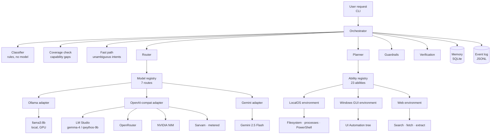
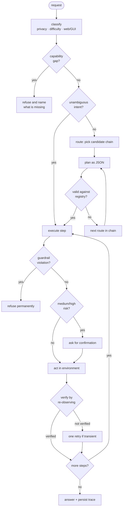
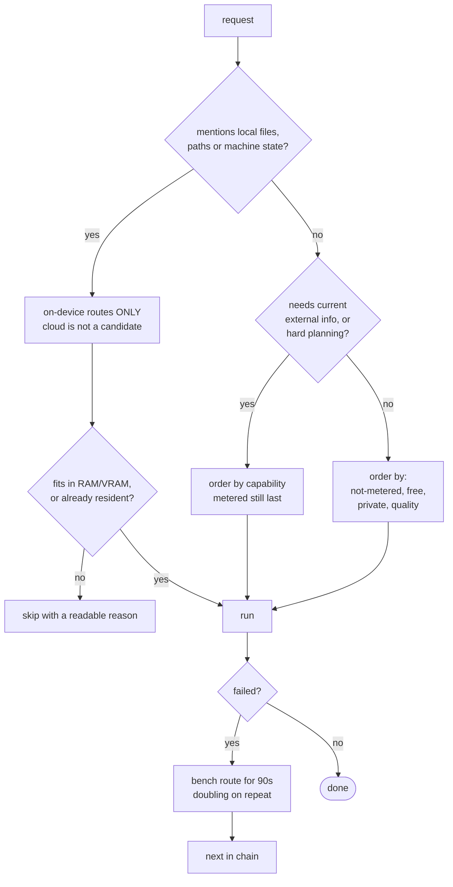
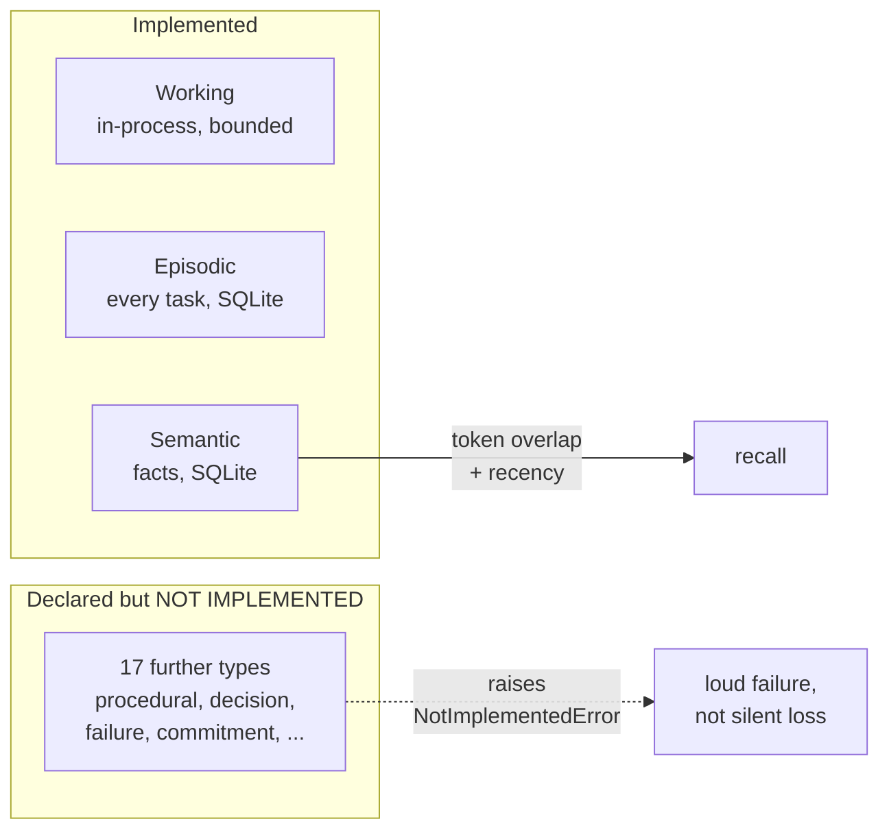

# JARVIS architecture

## Why this shape

The system exists to answer one question left open by the ARIA (local-only) vs.
Mark-XXXIX (cloud-only) study: *can request-level hybrid routing capture the
privacy of on-device inference and the capability of a remote model at the same
time?* Everything below serves that, plus a second requirement the baseline
systems did not meet — **never report success that did not happen**.

It is a modular monolith: one Python process, hard internal seams. Splitting into
services would add deployment cost and buy nothing at this scale, but each module
depends only on the contracts in `core/contracts.py`, so a boundary can become a
process boundary later without a rewrite.

---

## Components

---

## Request lifecycle

The important edge is `VER`. The model's claim never sets the outcome; the
outcome is set by reading the filesystem, the process table, or the window tree
back afterwards.

---

## Routing

**Privacy is a filter, not a weight.** For a local-only request the cloud routes
are removed from the candidate list entirely, so no ranking accident can send a
filename to a remote API.

**Cost order is deliberate.** `preference_key` sorts by
`(last_resort, not free, not private, -quality)`. A metered provider with a small
prepaid balance therefore sorts last even though its quality score is high — it
is never spent on work another route can do.

**The circuit breaker is time-boxed.** Permanent benching was a real defect: one
120-second read timeout on the only local model took down every subsequent
request in a benchmark run. Cooldown now starts at 90 s and doubles per
consecutive failure, and any success clears it.

---

## Memory

Semantic recall is token-overlap scoring, not vector search. That is a stated
limitation, isolated behind `MemoryStore.recall()` so an embedding backend can
replace it without touching callers — LM Studio already serves a nomic embedding
model locally for exactly that upgrade.

---

## Security model

Three layers, in this order, and the first cannot be reached around:

1. **Guardrails** (`policy/guardrails.py`) — destructive commands, deletion
   abilities, and writes to protected system roots are refused. Evaluated before
   any confirmation logic, so no autonomy setting or model output bypasses them.
2. **Risk tiers** — each `Ability` declares low/medium/high. Medium and high
   prompt for confirmation; `--yes` auto-approves and logs that it did.
3. **Audit** — every model call, ability execution, verification result and
   refusal is appended to `data/events.jsonl`, with credential-shaped strings
   scrubbed by pattern before writing.

Keys live in a gitignored `config/keys.json`, are read at the HTTP layer only,
and never enter a prompt body.

**Known gaps** (see `CAPABILITY_ONTOLOGY.md`): no sandboxing — abilities run with
the user's full privileges; no prompt-injection defence — text fetched from the
web is not yet treated as hostile; no OS keystore integration.

---

## Extension points

| To add | Do this | Core changes |
|---|---|---|
| A capability | One `Ability` in `abilities/registry.py` + a handler in an environment | none |
| An environment | Implement `state / capabilities / constraints / act / verify` | none |
| A model provider | One row in `models/registry.py` | none, unless its wire format is new |
| A wire protocol | One `Provider` subclass | one dict entry |
| A verification strategy | A branch in that environment's `verify()` | none |

Four of the seven registered providers already share a single OpenAI-compatible
adapter, which is the clearest evidence that the seam works.
